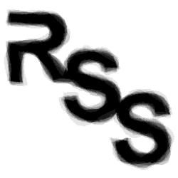

<h2> Restorable segmentation synthesis (RSS) tool</h2>

## Environment

`RSS-tool` was developed and tested in Python 3.8, it depends on packages of the environment listed in [environment.txt](environment.txt).

